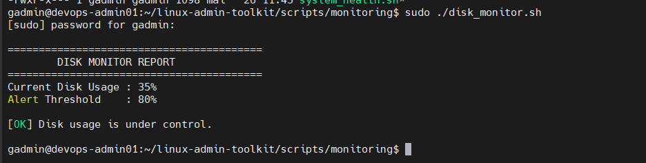
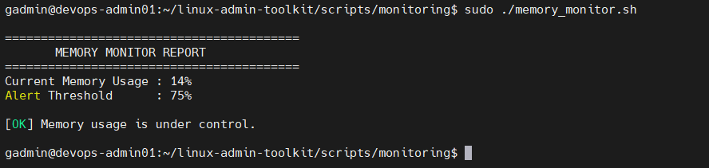
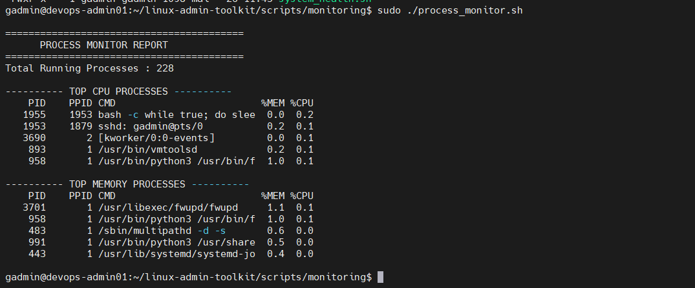
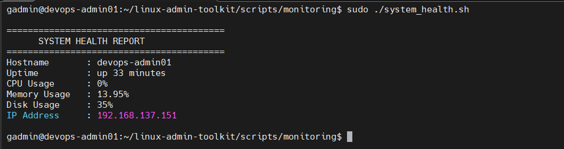
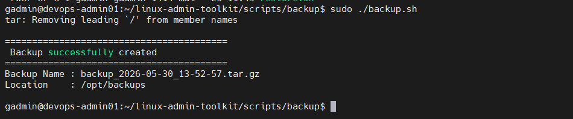
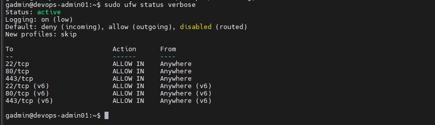
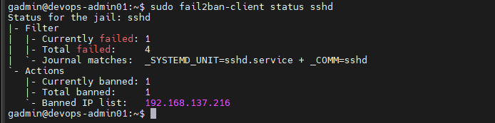
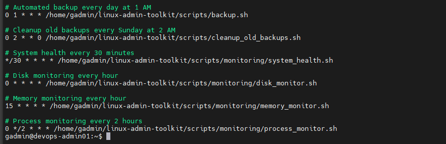
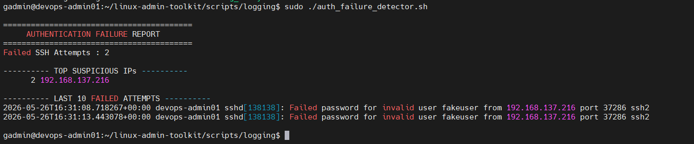
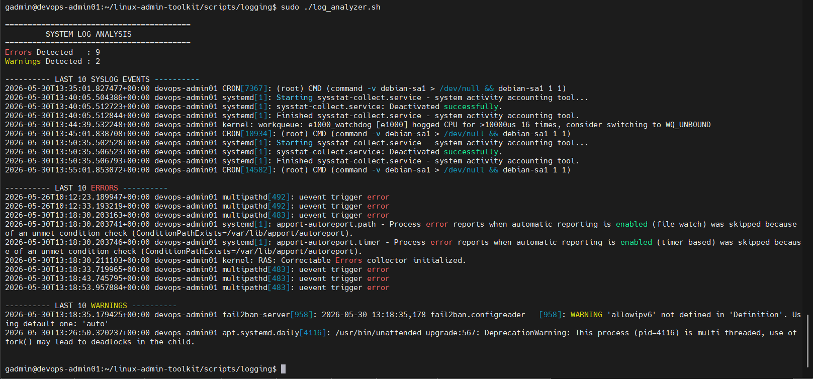

# Linux Administration & Automation Toolkit

Professional Linux System Administration and DevOps-oriented automation project built in a virtualized environment using Bash scripting, monitoring, backup automation, security hardening, and centralized logging.

---

# Project Overview

This project was designed to simulate real-world Linux system administration and DevOps operational tasks.

The toolkit includes:
- Linux server administration
- User & group management
- Backup automation
- Monitoring toolkit
- Linux security hardening
- Task automation
- Centralized logging

The project was developed in a VMware Workstation virtual environment running Ubuntu Server.

---

# Project Objectives

The main objectives of this project were:

- Strengthen Linux administration skills
- Practice Bash scripting professionally
- Implement Linux hardening techniques
- Automate administrative tasks
- Implement monitoring and logging solutions
- Build a reproducible DevOps-oriented lab environment

---

# Technologies Used

| Technology               | Purpose                |
|--------------------------|------------------------|
| Ubuntu Server            | Linux Environment      |
| Bash Scripting           | Automation             |
| Cron                     | Task Scheduling        |
| UFW                      | Firewall Management    |
| Fail2ban                 | Brute-force Protection |
| Git & GitHub             | Version Control        |
| VMware Workstation       | Virtualization         |

---

# Project Architecture

```bash
linux-admin-toolkit/
├── documentation
│   ├── linux-security-hardening
│   │   ├── fail2ban_conf
│   │   ├── linux_perm_hard
│   │   ├── module_obj
│   │   ├── module_structure
│   │   ├── ssh_hard
│   │   ├── sudo_policy
│   │   └── ufw_conf
│   └── task-automation
│       ├── automated_backup_scheduling
│       ├── automated_monitoring_tasks
│       ├── automation_strategy
│       ├── automation_validation
│       ├── cron_jobs_fundamentals
│       ├── log_management
│       └── module_obj
├── logs
│   ├── backup.log
│   ├── log_analysis.log
│   ├── monitoring.log
│   └── user_management.log
├── scripts
│   ├── backup
│   │   ├── backup.sh
│   │   ├── clean_old_backups.sh
│   │   └── restore.sh
│   ├── logging
│   │   ├── auth_failure_detector.sh
│   │   └── log_analyzer.sh
│   ├── monitoring
│   │   ├── disk_monitor.sh
│   │   ├── memory_monitor.sh
│   │   ├── process_monitor.sh
│   │   └── system_health.sh
│   └── user-management
│       ├── create_user.sh
│       ├── delete_user.sh
│       ├── lock_user.sh
│       └── password_policy.sh
└── security-hardening-lab
    ├── confidential.txt
    ├── internal.txt
    └── public.txt

```

---

# Implemented Modules

## MODULE 1 — Initial Linux Server Setup
- Linux installation
- Hostname configuration
- SSH configuration
- Essential packages installation

---

## MODULE 2 — User & Group Administration
Scripts:
- create_user.sh
- delete_user.sh
- lock_user.sh
- password_policy.sh

Features:
- User lifecycle management
- Password policy enforcement
- Account locking automation

---

## MODULE 3 — Backup Automation System
Scripts:
- backup.sh
- restore.sh
- cleanup_old_backups.sh

Features:
- Automated backups
- Backup restoration
- Backup retention management

---

## MODULE 4 — Monitoring Toolkit
Scripts:
- system_health.sh
- disk_monitor.sh
- memory_monitor.sh
- process_monitor.sh

Features:
- Disk monitoring
- Memory monitoring
- Process monitoring
- Health reporting

---

## MODULE 5 — Linux Security Hardening

Implemented:
- SSH hardening
- UFW firewall configuration
- Fail2ban protection
- Sudo policies
- Linux permissions hardening

Security Features:
- Brute-force mitigation
- Access restriction
- Secure SSH authentication
- Least privilege implementation

---

## MODULE 6 — Task Automation

Implemented:
- Cron jobs
- Automated backups
- Scheduled monitoring
- Automated maintenance tasks

---

## MODULE 7 — Centralized Logging

Scripts:
- log_analyzer.sh
- auth_failure_detector.sh

Features:
- Authentication failure detection
- Syslog analysis
- Security event monitoring
- Log reporting

---

# Security Features

- SSH Key Authentication
- UFW Firewall
- Fail2ban Intrusion Prevention
- Secure Permissions
- Sudo Policy Enforcement
- Authentication Monitoring

---

# Automation Features

- Scheduled Backups
- Automated Monitoring
- Log Generation
- Cleanup Automation
- Cron-based Operations

---

# Monitoring & Logging

The project includes:
- System health monitoring
- Disk usage monitoring
- Memory usage monitoring
- Process monitoring
- Authentication failure detection
- Centralized log analysis

---

# Installation & Usage

## Clone Repository

```bash
git clone https://github.com/davidgottlieb13/linux-admin-toolkit.git
```

## Navigate to Project

```bash
cd linux-admin-toolkit
```

## Make Scripts Executable

```bash
chmod +x scripts/*.sh
chmod +x scripts/monitoring/*.sh
chmod +x scripts/logging/*.sh
chmod +x scripts/backup/.*sh
chmod +x scripts/user-management/.*sh
```

## Execute Scripts

Example:

```bash
./scripts/backup.sh
```

```bash
./scripts/monitoring/system_health.sh
```

---

# Screenshots

- Monitoring outputs
  
  
  
  
  
- Backup execution
  
  
- UFW configuration
  
  
- Fail2ban status
  
  
- Cron jobs
  
  
- Logging analysis
  
  

---

# Future Improvements

Potential future improvements:
- Docker integration
- Ansible automation
- Centralized SIEM integration
- Grafana dashboards
- ELK Stack integration
- Email alerting
- CI/CD integration

---

# Author

David Gottlieb SITTI

Master's Student in Cybersecurity  
Aspiring DevOps & Cloud Engineer  
Linux System Administration Enthusiast

---

# Disclaimer

This project was built for educational, professional training, and portfolio purposes.
